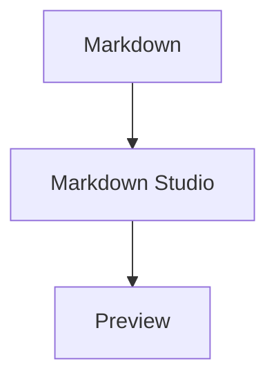

# Markdown Studio Documentation Website — AI Implementation Specification

## 1. Mission

Build a professional public documentation and product website for **Markdown Studio**, the cross-platform desktop Markdown editor in this repository.

Repository:
`https://github.com/nasimuddinbd02/markdown-studio`

The website must support GitHub Pages hosting, Google search indexing, product discovery, downloads, user documentation, troubleshooting, releases, and future pricing/monetization pages.

## 2. Critical Instructions for the AI Agent

Before making changes:

1. Inspect the complete repository structure.
2. Inspect `README.md`, existing `docs/`, SRS, traceability documents, `package.json`, `src/`, `src-tauri/`, GitHub Actions, release configuration, screenshots/assets, current version, supported OSes, and installer formats.
3. Determine which features are actually implemented.
4. Reuse existing documentation and branding where appropriate.
5. Do not document or advertise features that are not implemented.
6. Do not invent versions, download links, pricing, user counts, reviews, ratings, awards, certifications, compatibility claims, or performance claims.

The source code and current release artifacts are the source of truth.

## 3. Goals

The website must allow visitors to:

- Understand Markdown Studio.
- Discover supported features.
- Download the application.
- Install it on supported platforms.
- Learn how to use it.
- Find answers to common questions.
- Troubleshoot problems.
- Read releases/changelog.
- View the roadmap.
- Visit the GitHub repository.
- Discover documentation through Google and other search engines.

Desired flow:

```text
Google Search
  -> Markdown Studio Website
  -> Product Overview
  -> Features
  -> Download
  -> Documentation
  -> FAQ / Troubleshooting
  -> GitHub
```

## 4. Technology

Use a static documentation/site framework.

Preferred: **VitePress**

Acceptable alternatives: Docusaurus or Astro Starlight.

Requirements:

- Static site generation.
- GitHub Pages compatible.
- Markdown content.
- Documentation navigation.
- Dark/light mode.
- Responsive design.
- SEO metadata.
- Sitemap.
- Syntax-highlighted code.
- No server-side backend.

## 5. Repository Structure

Prefer keeping the site inside the existing repository:

```text
markdown-studio/
├── src/
├── src-tauri/
├── tests/
├── docs/
│   └── DOCUMENTATION_SITE_SPEC.md
├── website/
│   ├── .vitepress/
│   │   ├── config.ts
│   │   └── theme/
│   ├── docs/
│   │   ├── index.md
│   │   ├── download.md
│   │   ├── features.md
│   │   ├── faq.md
│   │   ├── changelog.md
│   │   ├── roadmap.md
│   │   ├── installation/
│   │   ├── getting-started/
│   │   ├── guide/
│   │   ├── reference/
│   │   └── troubleshooting/
│   ├── public/
│   │   └── images/
│   ├── package.json
│   └── README.md
└── .github/
    └── workflows/
        └── documentation.yml
```

If an existing documentation infrastructure is present, improve it rather than creating a duplicate.

## 6. Information Architecture

Primary navigation:

```text
Home
Download
Features
Documentation
FAQ
Changelog
Roadmap
GitHub
```

Documentation navigation:

```text
Documentation
├── Getting Started
│   ├── Introduction
│   ├── Installation
│   └── First Document
├── User Guide
│   ├── Editor
│   ├── File Explorer
│   ├── Tabs
│   ├── Preview
│   ├── Search & Replace
│   ├── Settings
│   └── Keyboard Shortcuts
├── Markdown
│   ├── Markdown Basics
│   ├── GitHub Flavored Markdown
│   ├── Tables
│   ├── Images
│   ├── Code Blocks
│   ├── Mermaid
│   └── Math / LaTeX
├── Import & Export
├── Troubleshooting
└── Reference
    ├── Keyboard Shortcuts
    ├── Configuration
    └── FAQ
```

Only create entries for actual supported features.

## 7. Homepage

Create a professional landing page.

Hero should communicate:

**Markdown Studio**

A modern desktop Markdown editor for Windows, macOS, and Linux.

Write, edit, preview, and organize Markdown documents from one fast local-first workspace.

Primary CTA: `Download Markdown Studio`

Secondary CTA: `View on GitHub`

Display only supported operating systems.

Do not use unsupported superlatives such as “Best”, “Fastest”, “#1”, or “World’s best”.

Homepage sections:

1. Hero.
2. Real application screenshot.
3. Feature overview.
4. Cross-platform support.
5. Local-first/privacy explanation based on actual behavior.
6. Latest release.
7. GitHub section.

Use actual screenshots from the repository when available. Do not create fake screenshots.

## 8. Download Page

Create `/download`.

Show platform-specific installers based on actual GitHub releases.

### Windows

Document actual supported architectures and installer formats.

Include:
- Download
- Requirements
- Installation
- Uninstallation
- Troubleshooting

### macOS

Document actual supported architectures/builds.

Include:
- Installation
- First launch
- Signing/notarization status if applicable
- Uninstallation

### Linux

Document only formats actually produced, such as:
- AppImage
- `.deb`
- `.rpm`

Do not display nonexistent artifacts.

Prefer official GitHub Releases as the download source.

## 9. Getting Started

Create `/docs/getting-started/`.

Include:

- Introduction.
- Installation.
- First launch.
- Open a folder.
- Create a Markdown document.
- Edit content.
- Open live preview.
- Save.

Use screenshots where useful.

## 10. Installation

Create:

```text
/docs/installation/windows
/docs/installation/macos
/docs/installation/linux
```

Each page must contain:

- Requirements
- Download
- Installation
- First launch
- Updates
- Uninstallation
- Troubleshooting

Platform-specific security messages must reflect actual signing/packaging.

## 11. Editor Guide

Create `/docs/guide/editor`.

Document actual capabilities such as:

- Editor layout.
- Syntax highlighting.
- Line numbers.
- Cursor navigation.
- Selection.
- Undo/redo.
- Copy/paste.
- Tabs.
- Split view.
- Find.
- Replace.
- Save.
- Save As.
- Auto-save.
- Recovery.

Only document implemented functionality.

## 12. File Explorer Guide

Create `/docs/guide/file-explorer`.

Document actual support for:

- Open folder.
- Browse files.
- Create file.
- Create folder.
- Rename.
- Delete.
- Refresh.
- External file changes.
- Workspace behavior.
- Recent files.

## 13. Markdown Documentation

Create `/docs/markdown/`.

Document supported syntax with examples:

```markdown
# Heading

**Bold**

*Italic*

- List

1. Ordered list

> Quote

[Link](https://example.com)


`inline code`

```python
print("Hello")
```

| Column | Value |
|---|---|
| A | B |
```

Examples must match the actual renderer.

## 14. GitHub Flavored Markdown

If supported, document verified support for:

- Tables.
- Task lists.
- Strikethrough.
- Fenced code blocks.
- Autolinks.
- Other supported GFM features.

Do not claim complete GFM support unless verified.

## 15. Mermaid

If implemented, create `/docs/markdown/mermaid`.

Document:

- Mermaid basics.
- Code block syntax.
- Supported diagram types.
- Preview.
- Export if applicable.
- Troubleshooting.

Example:



## 16. Math / LaTeX

If implemented, create `/docs/markdown/math`.

Document:

- Inline math.
- Block math.
- Examples.
- Rendering.
- Supported syntax.
- Limitations.

## 17. Images

Create `/docs/markdown/images`.

Document actual behavior for:

- Local images.
- Relative paths.
- Absolute paths if supported.
- Drag and drop if implemented.
- Preview.
- Export.

## 18. Tables

Create `/docs/markdown/tables`.

Document:

- Basic tables.
- Alignment.
- Editing behavior.
- Preview behavior.

## 19. Import and Export

Create `/docs/guide/import-export`.

Document only implemented formats.

For each format include:

- Supported.
- How to use.
- Limitations.
- Example.

## 20. Keyboard Shortcuts

Create `/docs/reference/keyboard-shortcuts`.

Build the shortcut table from the actual implementation.

Example:

| Action | Windows/Linux | macOS |
|---|---|---|
| Save | Ctrl+S | Cmd+S |
| Open | Ctrl+O | Cmd+O |
| New | Ctrl+N | Cmd+N |
| Find | Ctrl+F | Cmd+F |

Do not assume shortcuts that are not implemented.

## 21. Settings

Create `/docs/guide/settings`.

Document actual settings such as:

- Theme.
- Font.
- Font size.
- Editor settings.
- Preview settings.
- Auto-save.
- Update settings.
- AI settings if implemented.

## 22. Troubleshooting

Create `/docs/troubleshooting/`.

Document actual common issues, potentially:

- Application does not start.
- File cannot be opened.
- File cannot be saved.
- Permission denied.
- Preview does not render.
- Mermaid issue.
- Math issue.
- Export issue.
- Update issue.
- Windows installation issue.
- macOS installation issue.
- Linux execution issue.

Each article should use:

```text
Problem
Symptoms
Possible Cause
Solution
Additional Diagnostics
Report an Issue
```

Do not invent problems.

## 23. FAQ

Create `/faq`.

Initial questions:

- What is Markdown Studio?
- Which operating systems are supported?
- Is Markdown Studio free?
- Does it work offline?
- Where are documents stored?
- Does Markdown Studio upload documents?
- Does it support GitHub Flavored Markdown?
- Does it support Mermaid?
- Does it support LaTeX?
- How do I report a bug?
- How do I request a feature?
- How do I uninstall Markdown Studio?

Answers must reflect actual behavior.

## 24. Changelog

Create `/changelog`.

Use actual GitHub release information.

Format:

```markdown
## vX.Y.Z

Released: YYYY-MM-DD

### Added
- ...

### Changed
- ...

### Fixed
- ...

### Security
- ...
```

Never fabricate release information.

## 25. Roadmap

Create `/roadmap`.

Use:

```text
Completed
In Progress
Planned
Considering
```

Use the existing project roadmap where available. Do not invent commitments or delivery dates.

## 26. Blog

Create `/blog`.

Support useful educational articles, for example:

- What Is Markdown?
- How to Edit Markdown Files on Windows.
- How to Preview Markdown.
- Markdown Tables Guide.
- How to Create Mermaid Diagrams in Markdown.
- Markdown vs HTML.
- How to Write a Great README.
- How to Create Technical Documentation with Markdown.
- Markdown Editor for Developers.

Articles must provide real value and must not use keyword stuffing.

## 27. SEO

Every public page must have:

- Unique title.
- Unique meta description.
- Canonical URL.
- Open Graph metadata.
- Social sharing metadata.
- Descriptive URL.
- One meaningful H1.
- Logical H2/H3 hierarchy.
- Descriptive image alt text.
- Internal links.

Example homepage metadata:

```text
Title:
Markdown Studio — Cross-Platform Markdown Editor

Description:
Markdown Studio is a desktop Markdown editor for Windows, macOS, and Linux with editing, live preview, file management, and more.
```

Adjust based on actual features.

## 28. Structured Data

Where appropriate, implement:

- `SoftwareApplication`
- `Organization`
- `WebSite`
- `BreadcrumbList`
- `Article`

Only include facts supported by the product.

Never invent ratings, reviews, awards, prices, or user counts.

## 29. Sitemap

Generate `/sitemap.xml`.

Include all public, indexable pages.

Exclude:

- Test pages.
- Duplicate pages.
- Private documentation.
- Development artifacts.
- Build artifacts.

## 30. robots.txt

Generate `/robots.txt`.

Allow normal crawling of public pages and reference the sitemap.

## 31. GitHub Search Console Documentation

Add documentation explaining how the site owner can:

1. Add the site to Google Search Console.
2. Verify ownership.
3. Submit `/sitemap.xml`.
4. Monitor indexing.
5. Review search queries.
6. Review SEO issues.

Never put credentials in the repository.

## 32. GitHub Pages Deployment

Create:

`.github/workflows/documentation.yml`

The workflow must:

1. Trigger when documentation website files change.
2. Install dependencies.
3. Build the static website.
4. Validate links/content where practical.
5. Upload the Pages artifact.
6. Deploy to GitHub Pages.

The workflow must fail if the site build fails.

## 33. Pull Request Validation

Provide appropriate scripts, such as:

```text
npm run docs:dev
npm run docs:build
npm run docs:preview
npm run docs:check
```

Use names appropriate to the selected framework.

Validation should detect, where practical:

- Broken internal links.
- Invalid Markdown.
- Missing metadata.
- Configuration errors.

## 34. Responsive Design

Support:

- Desktop.
- Laptop.
- Tablet.
- Mobile.

Requirements:

- Mobile navigation.
- Responsive sidebar.
- Responsive tables.
- Horizontal scrolling for long code blocks.
- Responsive screenshots.
- Touch-friendly controls.

## 35. Visual Design

The site should feel:

- Modern.
- Professional.
- Developer-focused.
- Clean.
- Technical.
- Fast.
- Minimal.

Use:

- Consistent spacing.
- Professional typography.
- Code-friendly fonts.
- Clear hierarchy.
- Subtle borders.
- Accessible colors.
- Consistent icons.

Avoid excessive animations.

## 36. Dark Mode

Support:

```text
Light
Dark
System
```

if supported by the framework.

Ensure code blocks, links, screenshots, and navigation remain readable.

## 37. Accessibility

Use semantic HTML.

Support:

- Keyboard navigation.
- Visible focus.
- Accessible buttons.
- Accessible navigation.
- Meaningful alt text.
- Sufficient color contrast.
- Screen-reader-friendly structure.
- No important information conveyed only by color.

## 38. Performance

Use static generation and minimize JavaScript.

Optimize:

- Images.
- JavaScript.
- CSS.
- Fonts.
- Client-side dependencies.

Target:

```text
Performance >= 90
Accessibility >= 90
Best Practices >= 90
SEO >= 90
```

These are targets, not guarantees.

## 39. Images

Use actual application screenshots where available.

Recommended:

```text
website/public/images/
├── markdown-studio-home.webp
├── markdown-studio-editor.webp
├── markdown-studio-preview.webp
├── markdown-studio-file-explorer.webp
└── markdown-studio-mermaid.webp
```

Use optimized image formats and descriptive alt text.

Do not create fake screenshots.

## 40. Privacy

Document actual privacy behavior.

If editing is local-first, explain what stays local.

If AI functionality sends content externally, document:

- What is sent.
- When it is sent.
- Which provider receives it.
- How the feature can be disabled.

Do not make unsupported privacy claims.

## 41. Security

The website must:

- Never expose GitHub tokens.
- Never expose API keys.
- Never expose signing certificates.
- Never commit `.env` secrets.
- Avoid unsafe HTML rendering.
- Sanitize dynamic content.
- Validate external links where appropriate.

## 42. GitHub Links

Use the actual repository:

`https://github.com/nasimuddinbd02/markdown-studio`

Provide links to:

- Repository.
- Issues.
- Discussions if enabled.
- Releases.
- Contributing.
- License.

## 43. Version Management

Avoid duplicating the application version manually.

Where practical:

```text
Application Version
  -> Website
  -> Download Page
  -> Changelog
  -> Release Information
```

Use package/release metadata as the source of truth.

## 44. Future Monetization

Design the website so future pages can be added:

```text
/pricing
/pro
/ai
/cloud
/teams
/enterprise
```

Do not implement payments unless explicitly requested.

## 45. AI Coding Agent Workflow

### Phase 1 — Repository Analysis

Before coding:

1. Inspect repository.
2. Inspect current documentation.
3. Inspect application source.
4. Identify implemented features.
5. Identify screenshots/assets.
6. Identify current version.
7. Identify release artifacts.
8. Identify current GitHub Actions.
9. Identify existing documentation infrastructure.

Create an internal feature inventory:

```text
Feature | Implemented? | Documentation exists? | Screenshot exists? | Release support?
```

### Phase 2 — Architecture

Select the documentation framework.

Document:

- Why it was selected.
- Where files will live.
- How it builds.
- How GitHub Pages deploys.

Avoid unnecessary dependencies.

### Phase 3 — Implementation

Implement:

1. Homepage.
2. Download page.
3. Features.
4. Getting Started.
5. Installation.
6. User Guide.
7. Markdown reference.
8. FAQ.
9. Troubleshooting.
10. Changelog.
11. Roadmap.
12. GitHub integration.
13. SEO.
14. Sitemap.
15. robots.txt.
16. GitHub Pages workflow.

### Phase 4 — Validation

Run:

```text
Build
Link validation
Markdown validation
Type checking
Linting
Tests
```

Fix errors before completion.

### Phase 5 — Deployment

Configure GitHub Pages and verify:

- Homepage.
- Download.
- Documentation.
- Navigation.
- Images.
- GitHub links.
- Release links.
- Sitemap.
- robots.txt.

## 46. Do Not Break the Desktop Application

The documentation website must not:

- Break the desktop build.
- Change application behavior unnecessarily.
- Replace application dependencies.
- Change Tauri configuration without justification.
- Change release configuration without justification.
- Remove existing tests.
- Remove working features.
- Delete useful existing documentation.

Keep website dependencies isolated where practical.

## 47. Definition of Done

The implementation is complete only when:

- [ ] Documentation website builds successfully.
- [ ] Desktop application still builds successfully.
- [ ] Existing tests still pass.
- [ ] Homepage exists.
- [ ] Download page exists.
- [ ] Installation documentation exists.
- [ ] Getting Started exists.
- [ ] User Guide exists.
- [ ] Markdown reference exists.
- [ ] FAQ exists.
- [ ] Troubleshooting exists.
- [ ] Changelog exists.
- [ ] Roadmap exists.
- [ ] GitHub links work.
- [ ] Release download links work.
- [ ] Sitemap exists.
- [ ] robots.txt exists.
- [ ] SEO metadata exists.
- [ ] Open Graph metadata exists.
- [ ] Structured data is valid where used.
- [ ] Internal links are validated.
- [ ] Mobile layout works.
- [ ] Dark mode works.
- [ ] Accessibility has been checked.
- [ ] No secrets are committed.
- [ ] No unsupported product claims are published.
- [ ] GitHub Actions builds the documentation site.
- [ ] GitHub Pages deployment succeeds.
- [ ] Published site is reachable.

## 48. Final Agent Report

At the end, report:

```text
1. Documentation framework selected
2. Files created
3. Files modified
4. Documentation pages created
5. Features documented
6. SEO implementation
7. Sitemap implementation
8. GitHub Pages workflow
9. Build command
10. Validation results
11. Local development command
12. Production deployment process
13. Remaining manual GitHub configuration
14. Features intentionally not documented because they are not implemented
```

Do not claim successful deployment unless it was actually verified.
