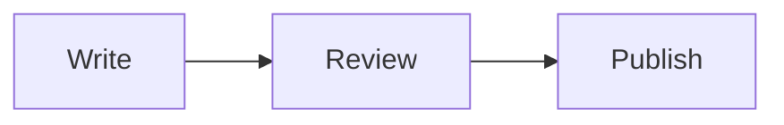
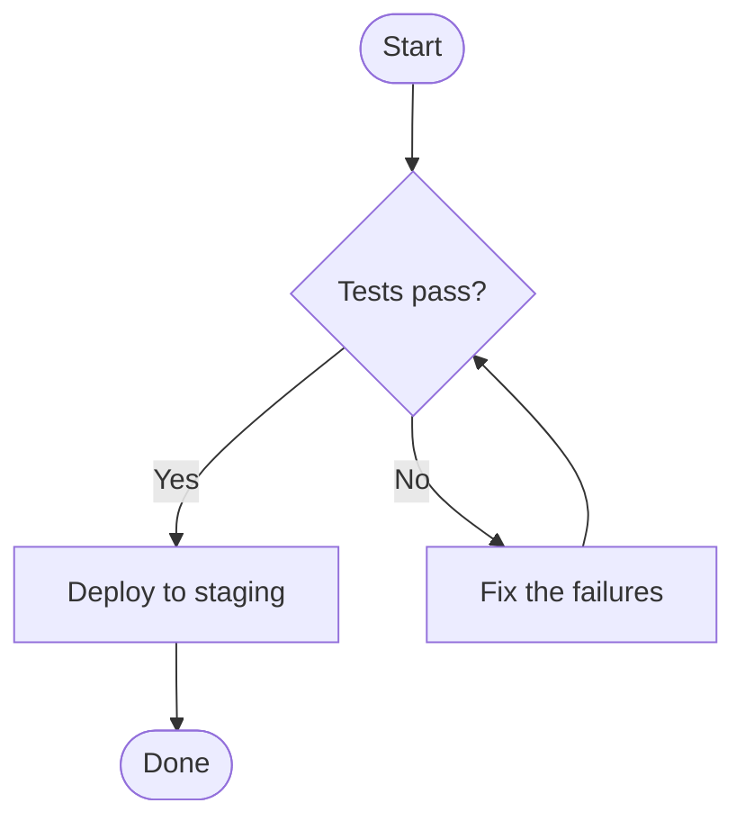
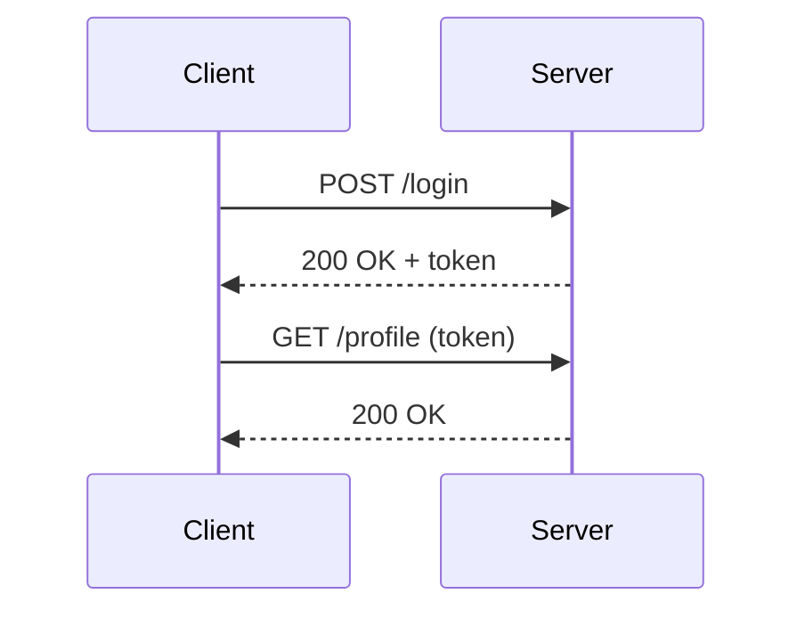
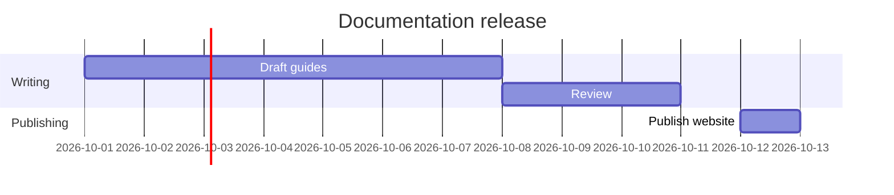

# How to create Mermaid diagrams in Markdown

*2026-09-25*

A diagram drawn in a graphics tool is a picture: to change one label, you open the tool again, edit, export and replace the image. [Mermaid](https://mermaid.js.org) takes a different approach. You describe the diagram in text inside your Markdown, and the viewer draws it. Changing a label means editing a word, and version control shows exactly what changed.

GitHub, GitLab and many editors, including [Markdown Studio](/markdown/mermaid), render Mermaid in Markdown files.

## The basic idea

Put the diagram in a code block whose language is `mermaid`:

````markdown

````

The first line names the diagram type. The rest describes it.

## Flowcharts

Flowcharts are the most common Mermaid diagram:

````markdown

````

- `TD` draws top-down; `LR` draws left to right.
- The shape comes from the brackets: `[box]`, `([rounded])`, `{decision}`, `((circle))`.
- `-->` is an arrow, `---` a line, and `-->|label|` a labelled arrow.

## Sequence diagrams

Sequence diagrams show messages between participants over time, which is ideal for APIs and protocols:

````markdown

````

`->>` is a solid arrow (a request) and `-->>` a dashed one (a response).

## Gantt charts

````markdown

````

## Tips for readable diagrams

- **Keep them small.** If a diagram needs scrolling, split it into two.
- **Quote labels with special characters:** `A["Save (Ctrl+S)"]`.
- **Use `subgraph`** to group related nodes in a flowchart.
- **Check errors early.** A syntax error stops the whole diagram from drawing, so preview as you type. Markdown Studio shows Mermaid's error message in place of the diagram.

## Where Mermaid works

Mermaid in Markdown renders on GitHub, GitLab, in many documentation site generators, and in editors with Mermaid support. For documents you share as files, check that the output format keeps the diagram: in Markdown Studio, **Export as HTML** and **Print → Save as PDF** include drawn diagrams (see [Mermaid](/markdown/mermaid#export)).

The [Mermaid documentation](https://mermaid.js.org/intro/) covers every diagram type, including class, state, entity-relationship, mindmap and timeline diagrams.
