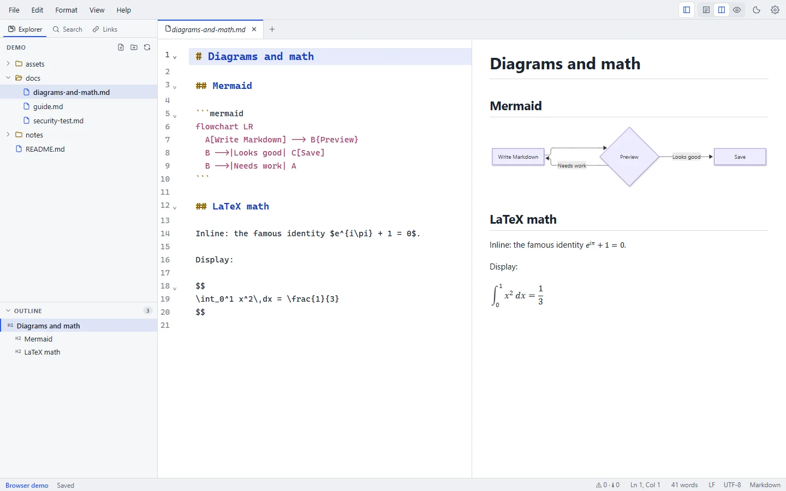

# Features

This page lists what Markdown Studio does today. Each feature links to its guide. Planned work is on the [roadmap](/roadmap).

<figure>
  
  <figcaption>Mermaid diagrams and LaTeX math render in the live preview.</figcaption>
</figure>

## Writing and editing

- A CodeMirror 6 editor with Markdown syntax highlighting, highlighting for code-block languages, line numbers, code folding, multiple cursors, and undo and redo per tab. [Editor guide](/guide/editor)
- A Format menu and shortcuts for bold, italic, strikethrough, inline code, links, headings 1–3, promoting and demoting headings, bulleted, numbered and task lists, quotes, code blocks, tables, horizontal rules and footnotes. [Writing tools](/guide/writing-tools)
- **Move Section Up/Down** moves a heading with its text and subsections past its neighbour.
- Tables: **Format Table** aligns columns (CJK-aware), and **Sort Table by Column** sorts rows. You can also paste cells from Excel or Google Sheets as a table, and copy a table as CSV. [Tables](/markdown/tables)
- A table of contents that stays up to date on save, and templates for new documents (meeting notes, README, blog post, ADR, status report, changelog, journal, plus your own). [Writing tools](/guide/writing-tools)
- Link autocompletion for workspace files, images and headings. Paste a URL over selected text to make a link.
- Paste or drop images. They're copied into an `assets/` folder next to the document and linked. [Images](/markdown/images)
- Rich paste: content copied from web pages or Word is converted to Markdown.
- Spell checking with the system dictionary, a word count with document and selection statistics, Focus Mode and Full Screen.

## Preview

- A live GitHub-style preview with a configurable update delay, synced scrolling, and editor-only, split and preview-only views. [Preview guide](/guide/preview)
- GitHub Flavored Markdown: tables, task lists, strikethrough, autolinks, and fenced code with syntax highlighting. [GFM](/markdown/gfm)
- Clickable task checkboxes that update the source.
- [Mermaid diagrams](/markdown/mermaid) and [LaTeX math](/markdown/math).
- [YAML front matter, GitHub alerts and footnotes](/markdown/extras).
- A large-document mode: above 1 MB of text, the live preview pauses and renders on demand, so typing stays fast.

## Files and workspaces

- Open a single file or a whole folder. The file explorer can create, rename (F2) and delete files and folders (to the Trash or Recycle Bin), reveal them in your file manager, and copy their paths. [File explorer](/guide/file-explorer)
- Tabs with unsaved-change markers, reordering, context actions (Close Others, Close to the Right, Close Saved), and Reopen Closed Tab. [Tabs](/guide/tabs)
- Find and replace in the document (case, whole word, regex), and Find in Files and Replace in Files across the folder (unsaved files are skipped; previous versions go to File History). [Search & replace](/guide/search-replace)
- A document outline (drag to reorder sections, copy a link to a heading), a command palette, Go to File (open any file in the folder by typing part of its name), and recent files and folders.
- Live folder watching: the explorer and open files update when other programs change files on disk.
- Opens files from your operating system: double-click, "Open with", or drag and drop onto the window. On Windows, the right-click menu has **Open with Markdown Studio**.

## Saving and safety

- Atomic saves, detection of files changed on disk (Reload, Compare or Keep Mine), and clear errors with next steps. [Saving & recovery](/guide/saving-and-recovery)
- Optional auto save after a delay or when switching tabs or windows.
- Local file history: the previous version is kept on every save (30 per file), with a line diff and restore.
- Crash recovery for unsaved documents, and session restore of the last folder and files.
- UTF-8 with or without BOM; LF and CRLF line endings are preserved per file.
- Save options: trim trailing whitespace, insert a final newline, and choose line endings for new files.

## Checking documents

- Markdown lint in the editor: broken links, missing images, broken anchors, duplicate headings, skipped heading levels and missing alt text, with a Problems panel. [Checking documents](/guide/checking-documents)
- A link check across the whole folder, including `file.md#heading` anchors.

## Import and export

- **Import** Word (`.docx`), PDF, web pages (`.html`) and CSV/TSV as Markdown, one file at a time or a whole folder. [Import & export](/guide/import-export)
- **Export** to PDF (selectable text, links, bookmarks) and Word (`.docx`) with real headings, lists and tables, to standalone HTML, or through Print → Save as PDF. You can also Copy as HTML.
- **Combine a folder** into one document with a table of contents, or export a whole folder as one PDF or Word file.

## App

- Light, dark and system themes; configurable editor font, size, wrapping and tab size. [Settings](/guide/settings)
- Keyboard-first: every command has a menu entry, many have [shortcuts](/reference/keyboard-shortcuts), and the command palette finds them all.
- Accessibility: keyboard navigation and visible focus throughout; the UI is audited automatically against WCAG 2.1 AA in light and dark themes.
- Automatic updates on Windows, verified with a signature before installing. macOS and Linux are notified of new versions.
- Diagnostic logs you can export for support. They never contain document text.

## Not included

These aren't part of Markdown Studio today. Some are [on the roadmap](/roadmap):

- AI writing features, cloud sync, collaboration, Git integration and plugins.
- MDX, and Markdown flavours beyond GitHub Flavored Markdown with the extensions listed above.
- Signed installers (Windows Authenticode, Apple notarization) and ARM64 builds for Windows and Linux.
