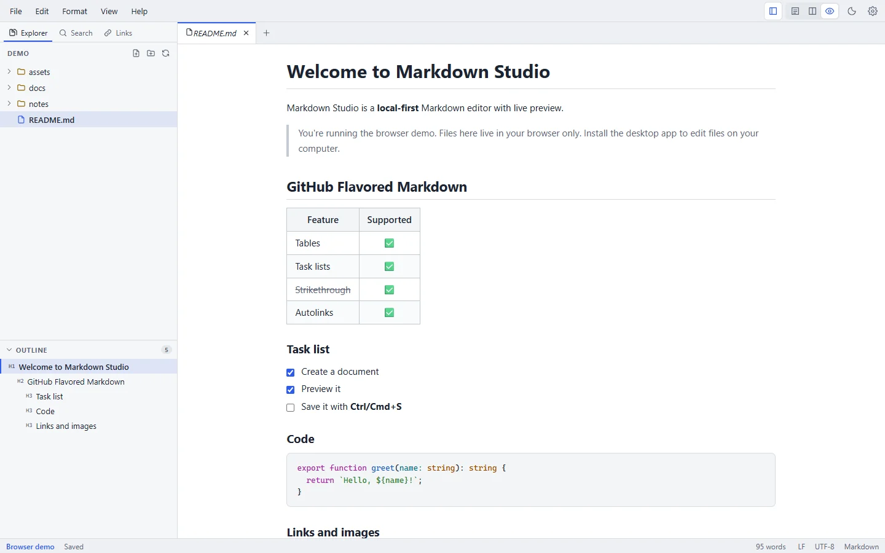

# Your first document

This walkthrough takes about five minutes. The shortcuts are shown for Windows and Linux; on macOS use **Cmd** instead of **Ctrl**.

## 1. Launch Markdown Studio

Start it from the Start menu (Windows), Applications (macOS) or your applications menu (Linux). The first time, you see the welcome screen with **New File**, **Open File** and **Open Folder**, plus your recent files once you have some.

## 2. Open a folder

Choose **Open Folder** (**Ctrl+Shift+O**) and pick the folder where you keep your notes or documentation. It becomes your workspace:

- The **Explorer** in the sidebar shows its folders and Markdown files (`.md`, `.markdown`). Hidden folders and folders such as `node_modules` are skipped.
- Markdown Studio can only access folders and files that you open this way. See [Privacy](/privacy).

You can also open a single file with **Open File** (**Ctrl+O**), double-click a `.md` file in your file manager, or drag one onto the window.

## 3. Create a document

Choose **File → New File** (**Ctrl+N**) to start an untitled document, or right-click a folder in the Explorer and choose **New File** to create it in that folder straight away. To start from a ready-made structure, use **File → New from Template…** (see [Writing tools](/guide/writing-tools#templates)).

## 4. Write

Type some Markdown:

```markdown
# Project notes

Markdown Studio shows the **preview** as you type.

## To do

- [x] Install Markdown Studio
- [ ] Write the first page

| Step | Status |
| --- | --- |
| Draft | Done |
| Review | Next |
```

Use the **Format** menu or shortcuts such as **Ctrl+B** (bold), **Ctrl+I** (italic) and **Ctrl+K** (link) instead of typing the syntax. The [Markdown basics](/markdown/) page covers the syntax.

## 5. Use the live preview

The preview on the right updates as you type, and scrolling stays in sync. Switch views with **Ctrl+1** (editor only), **Ctrl+2** (split) and **Ctrl+3** (preview only), or cycle through them with **Ctrl+\\**. You can tick task checkboxes directly in the preview.

<figure>
  
  <figcaption>Preview-only view (Ctrl+3).</figcaption>
</figure>

## 6. Save

Press **Ctrl+S**. For a new document you choose a name and location; after that, **Ctrl+S** saves in place. The tab's dot and the status bar show unsaved changes, and Markdown Studio asks before closing a document with unsaved changes. See [Saving, history & recovery](/guide/saving-and-recovery) for auto save and file history.

## Next steps

- Explore the [editor](/guide/editor) and [writing tools](/guide/writing-tools).
- Try [Mermaid diagrams](/markdown/mermaid) and [math](/markdown/math).
- Export your document as [PDF or Word](/guide/import-export#export).
