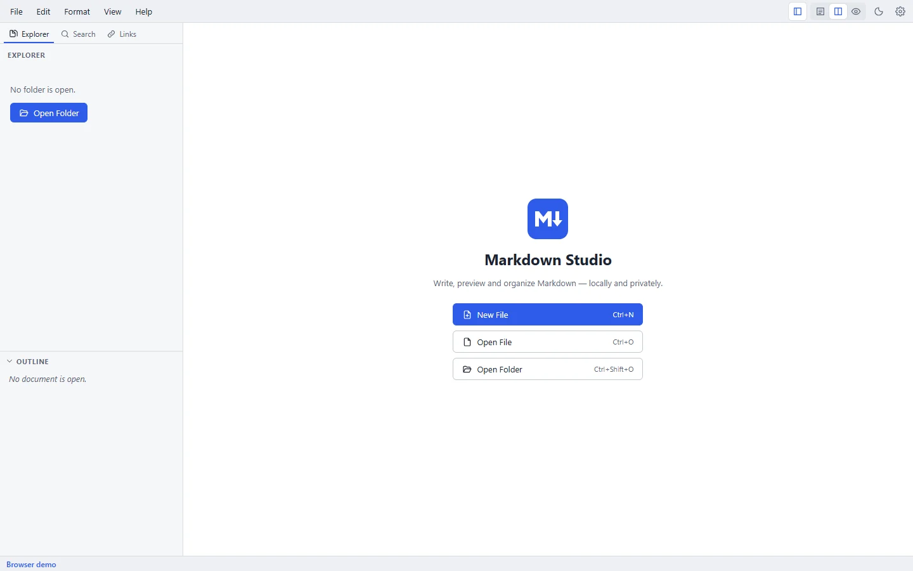

# Introduction

Markdown Studio is a desktop Markdown editor for Windows, macOS and Linux. You write in an editor on one side and see the rendered document on the other. It works directly with the `.md` files on your computer: there's no account, no cloud and no import step.

<figure>
  
  <figcaption>The welcome screen when no document is open.</figcaption>
</figure>

## Who it's for

- **Developers** editing READMEs, changelogs and technical notes, with code highlighting, tables and Mermaid diagrams.
- **Technical writers** managing a folder of documents with an outline, cross-file links, a link checker, and PDF or Word export.
- **Anyone who writes in Markdown** and wants a focused, private, offline editor.

## How the window is laid out

| Area | What it does |
| --- | --- |
| Menu bar | File, Edit, Format, View and Help menus, and buttons for the explorer, views, theme and settings |
| Sidebar | **Explorer** (folder tree), **Search** (Find in Files) and **Links** (link check), with the **Outline** below |
| Tabs | One tab per open document; a dot marks unsaved changes |
| Editor | Where you type Markdown |
| Preview | The rendered document, updated as you type |
| Status bar | Save state, problems, line and column, word count, line endings, encoding |

## Where to go next

1. [Install Markdown Studio](/getting-started/installation) on your system.
2. [Create your first document](/getting-started/first-document).
3. Learn the [editor](/guide/editor), the [Markdown syntax](/markdown/) it supports, and its [keyboard shortcuts](/reference/keyboard-shortcuts).

::: tip Find any command
Press **Ctrl+Shift+P** (Windows, Linux) or **Cmd+Shift+P** (macOS), or **F1**, to open the command palette and search every command by name.
:::
