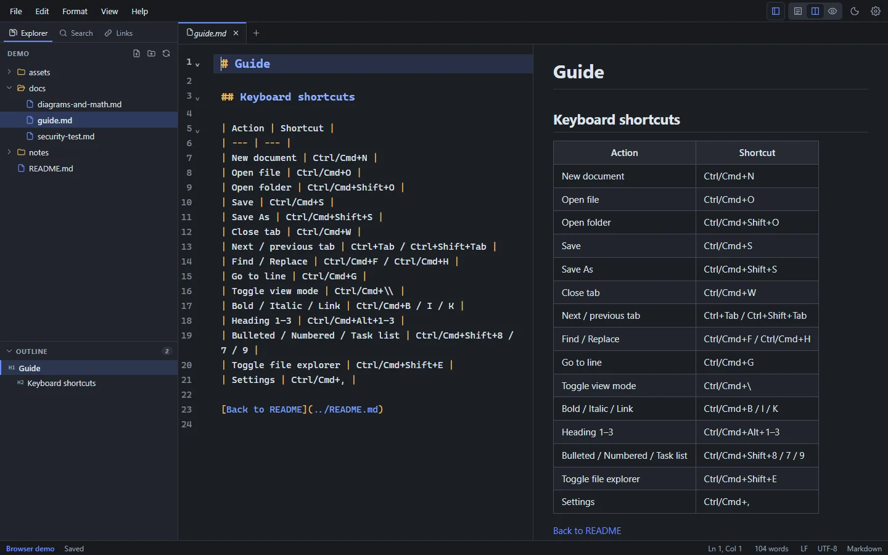

# File explorer

The file explorer shows the folder you're working in, your **workspace**. Open it with **File → Open Folder…** (**Ctrl+Shift+O**, or **Cmd+Shift+O** on macOS). Show or hide the sidebar with **Ctrl+Shift+E**.

<figure>
  
  <figcaption>The Explorer (top left) and Outline (bottom left), in the dark theme.</figcaption>
</figure>

## What's shown

- Folders and Markdown files (`.md` and `.markdown`), sorted with folders first.
- Hidden folders (starting with `.`) and dependency or build folders such as `node_modules`, `target`, `dist` and `build` are skipped.
- Folders load when you expand them, so large folders open quickly.
- The file in the active tab is highlighted.

## Create, rename and delete

| Action | How |
| --- | --- |
| New file | The **New file** button at the top of the Explorer, or right-click a folder → **New File…** |
| New folder | The **New folder** button, or right-click a folder → **New Folder…** |
| Rename | Select an item and press **F2**, or right-click → **Rename…**. Open tabs follow the rename |
| Delete | Right-click → **Delete…**. After you confirm, the item goes to the Trash or Recycle Bin, so it can be restored |
| Refresh | The **Refresh** button |

Other right-click actions: **Open**, **Reveal in File Explorer** (**Reveal in Finder** on macOS, **Open Containing Folder** on Linux), **Copy Path** and **Copy Relative Path**.

## Changes made by other programs

Markdown Studio watches the workspace folder. When another program (Git, a script, another editor) adds, removes or changes files, the Explorer updates straight away.

If a file that's open in a tab changes on disk:

- If the tab has **no unsaved changes**, it reloads automatically.
- If it **has unsaved changes**, a banner offers **Reload (discard mine)**, **Compare** or **Keep Mine**, so nothing is overwritten without you deciding. See [Saving & recovery](/guide/saving-and-recovery#files-changed-on-disk).

## Workspace access

Markdown Studio can read and write only inside folders and files you've opened yourself (or reopened from the recent list). That keeps the app from reaching anything else on your computer. See [Privacy](/privacy).

## Go to File

**File → Go to File…** (**Ctrl+Alt+O**, **Cmd+Option+O** on macOS) opens any Markdown file in the folder by typing part of its name or path, for example `guide` or `docs/inst`. The letters don't have to be next to each other: `dm` finds `diagrams-and-math.md`. Files that are already open are listed first. Press **Enter** to open the highlighted file.

## Recent files and folders

The **File** menu and the welcome screen list recently opened files and folders. By default, the next start reopens your last folder and files; turn this off with **Settings → Startup → Reopen last folder and files**. **File → Close Folder** closes the workspace.

## Search and links across the folder

The sidebar has two more views for the whole workspace:

- **Search** (**Ctrl+Shift+F**) finds text in every Markdown file. See [Search & replace](/guide/search-replace#find-in-files).
- **Links** checks every link in every file. See [Checking documents](/guide/checking-documents#link-check).
