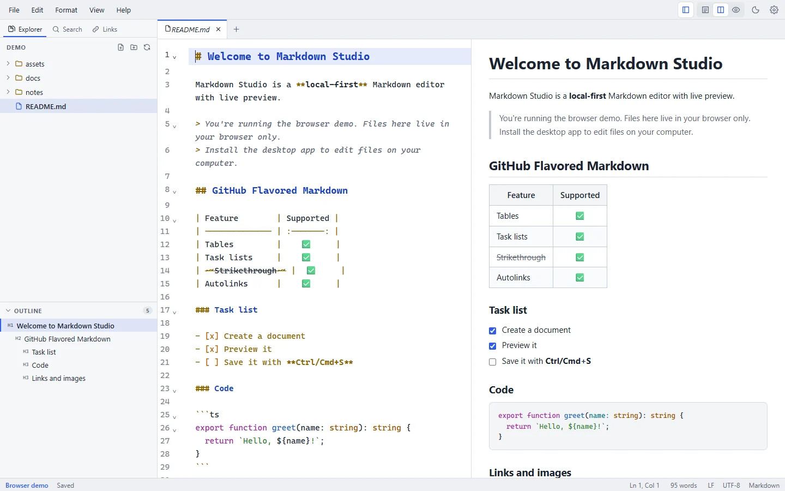

## See it in action

<figure class="ms-screenshot">
  
  <figcaption>The editor, file explorer, outline and live preview in split view.</figcaption>
</figure>

## Runs on your operating system

Markdown Studio is a native desktop app built with [Tauri](https://tauri.app). Every release has a separate installer for each system, and nothing else needs to be installed:

| System | Installers |
| --- | --- |
| **Windows** 10 (1803+) and 11, x64 | Standard installer, or an offline installer that includes WebView2 |
| **macOS** 10.15+ | `.dmg` for Apple Silicon and for Intel |
| **Linux** x86_64 | AppImage, `.deb` and `.rpm` |

[Download Markdown Studio](/download) · [Installation guides](/getting-started/installation)

## Local-first by design

- **Your documents stay on your computer.** Markdown Studio edits files in place on your disk. There's no account, no cloud sync and no telemetry.
- **No internet needed to write.** Everything works offline. The app's only own network request is the update check to GitHub at startup, which you can turn off in Settings. Images with web (`https://`) addresses in your documents are loaded from the web when you preview them, as in a browser.
- **Safe rendering.** HTML inside Markdown is sanitized with GitHub's allow-list: scripts, event handlers, iframes and forms are removed, and links open in your browser.
- **Limited access.** The app can only reach files and folders you open yourself.

Read the full [privacy notes](/privacy).

## Latest release

**Markdown Studio {{ release.version }}**, released {{ release.date }}. See [what's new](/changelog) or <a :href="release.releaseUrl">all release files on GitHub</a>.

## Developed in public on GitHub

Markdown Studio's source code, issues and releases are public at [github.com/nasimuddin-dev/markdown-studio](https://github.com/nasimuddin-dev/markdown-studio). [Report a bug or request a feature](https://github.com/nasimuddin-dev/markdown-studio/issues), browse [releases](https://github.com/nasimuddin-dev/markdown-studio/releases), or read the source.
