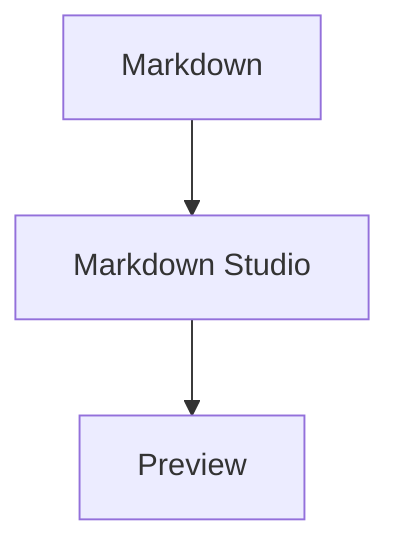
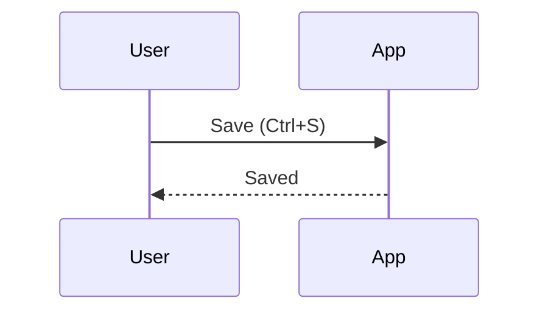
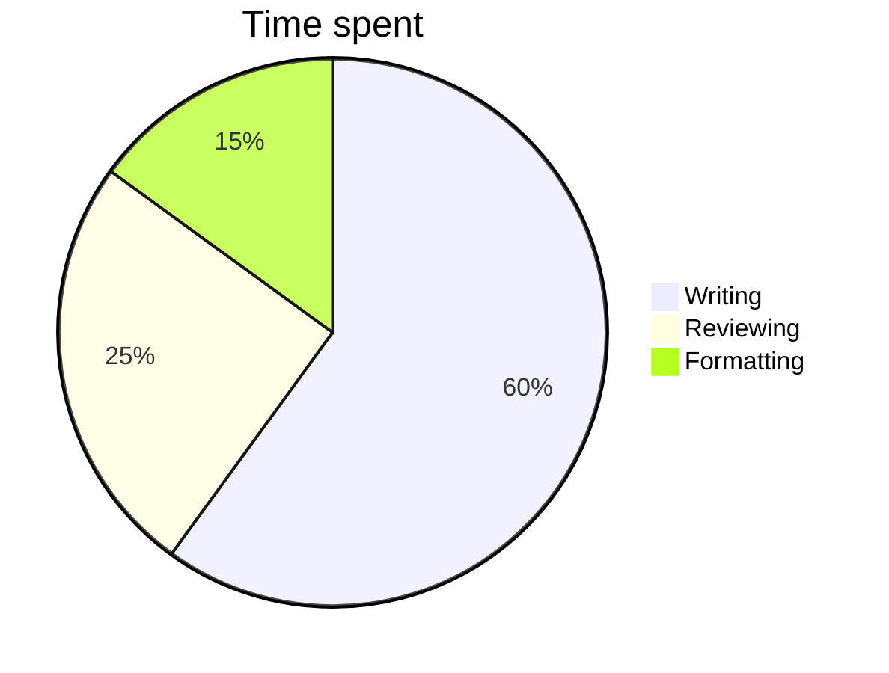

# Mermaid diagrams

[Mermaid](https://mermaid.js.org) turns text into diagrams. Write the diagram in a code block with the language `mermaid`, and the preview draws it.

<figure>
  
  <figcaption>A Mermaid flowchart in the editor (left) and preview (right).</figcaption>
</figure>

## Syntax

````markdown

````

A few more examples:

````markdown

````

````markdown

````

## Supported diagram types

Markdown Studio includes Mermaid 12, so it draws the diagram types that version supports, including flowcharts (`graph` / `flowchart`), sequence, class, state, entity-relationship, Gantt, pie, user journey, Git graph, mindmap, timeline, quadrant and XY charts. See the [Mermaid documentation](https://mermaid.js.org/intro/) for the syntax of each.

## Preview

- Diagrams are drawn in the preview as you type, and follow the light or dark theme.
- Mermaid runs in **strict security mode**: click handlers and HTML inside labels are disabled, and the output is sanitized.
- Mermaid loads only when a document contains a diagram, so it doesn't slow down startup.
- To show the code instead of the diagram, turn off **Settings → Preview → Render Mermaid diagrams**.

## Export

| Export | Diagram |
| --- | --- |
| Export as HTML | Drawn, embedded in the file as SVG |
| Print / Save as PDF | Drawn, as in the preview |
| Export as PDF, Export as Word | The diagram's code, as a code block |

For a PDF with diagrams, use **File → Print / Save as PDF…**.

## Troubleshooting

If a diagram has a syntax error, the preview shows **Diagram error:** followed by Mermaid's message instead of the diagram. Common causes:

- A misspelled diagram type on the first line (`flowchart`, `sequenceDiagram`, `classDiagram`, …).
- Special characters in labels: put the label in quotes, for example `A["Save (Ctrl+S)"]`.
- Arrows with the wrong syntax for the diagram type: `-->` in flowcharts, `->>` in sequence diagrams.

More help: [Preview, Mermaid & math troubleshooting](/troubleshooting/preview).
